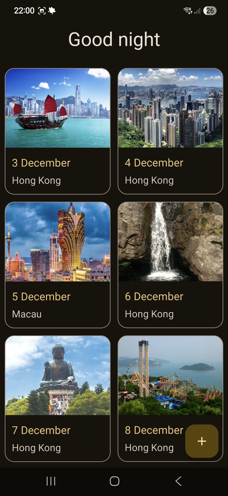
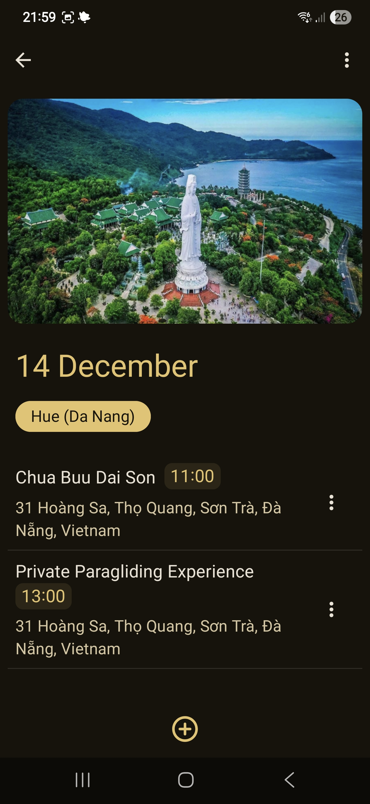
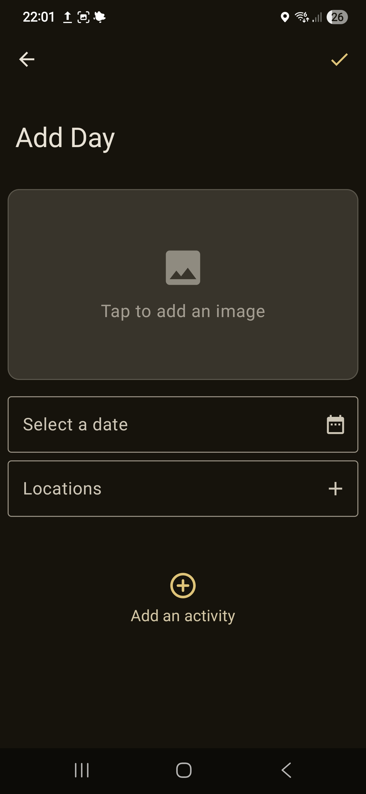
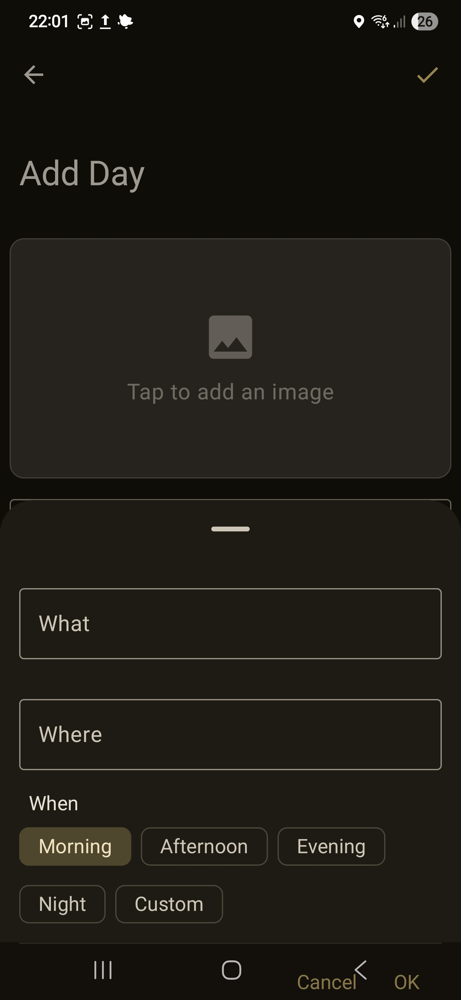

# Voyager

**Voyager** is an Android travel itinerary app built with **Jetpack Compose** that helps you organize your trips effortlessly. Create day-by-day travel plans, set activities, and keep track of your adventures -- all offline-friendly thanks to a local **Room database**.

---

## Features

- **Day-wise itinerary:** Organize your trip by days and create day-items for each day of your travel.
- **Activity management:** Add activities to each day with flexible timing:
  - Abstract times: Morning, Noon, Evening
  - Specific times: Set a reservation or precise timing
- **Destination details:** Specify the country and city for each day and add an image for your destination.
- **Offline support:** All your data is stored locally using **Room**, so you can access your itinerary without internet.
- **Modern UI:** Built entirely with **Jetpack Compose**, providing a clean and smooth user experience.

---

## Screenshots
<table>
  <tr>
    <td></td>
    <td></td>
  </tr>
  <tr>
    <td></td>
    <td></td>
  </tr>
</table>

## Tech Stack

- **Language:** Kotlin
- **UI:** Jetpack Compose
- **Database:** Room
- **Architecture:** MVVM (Model-View-ViewModel)

---

## Installation

1. Clone the repository:
   ```bash
   git clone https://github.com/Jashvant27/Voyager.git
   ```
2. Open the project in **Android Studio**.
3. Build and run the app on an emulator or a physical device.

---

## Usage

1. Add a new day to your itinerary and set the country/city.
2. Add activities for that day, specifying either abstract or specific times.
3. Optionally, attach an image for the destination.
4. All your data will be stored locally and can be accessed anytime, even offline.

---

## Contributing

I'm not actively maintaining the app, but contributions are always welcome! If you want to improve Voyager or add new features, feel free to open a pull request or submit an issue.

---

Made with ❤️ using Kotlin & Jetpack Compose

